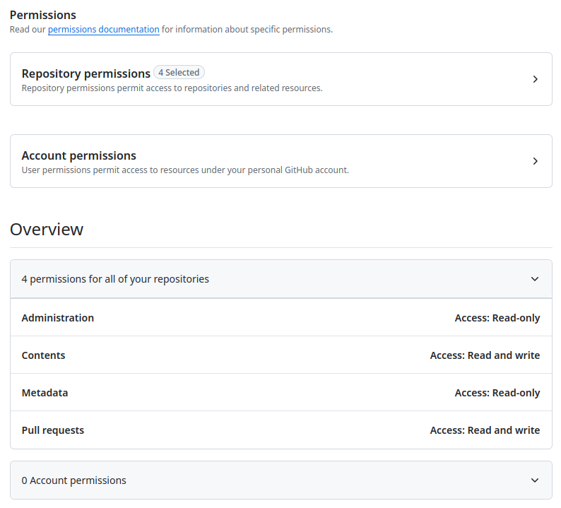

# batchpatch

Inspired by https://github.com/financial-times/nori

## What is batchpatch?

Sometimes, you have an update which you need to apply to a _lot_ of projects. Some security thing, deprecation thing, etc....

It's really time-consuming to check out all of those repos, apply the fix, then commit, push, PR, review, etc.

So - that's where batchpatch comes in. Prepare your change either as a .diff file or as a script; prepare a list of repositories to run it on;
and off you go.

## First time setup

1. Make sure that your username and email are configured in git. If you use git on your computer normally you'll have done this.  Otherwise, use 
`git config` to set them up
2. Create a Github personal access token for the app to use.  This is needed for cloning private repos in https mode, pushing branches and creating PRs.

A fine-grained token is recommended; under your profile menu, go to `Settings` then to `Developer Settings` and select
`Fine-grained tokens` in the menu on the left.

Then click `Generate New Token` and assign the following permissions:


- Administration (read-only) is optional, I use it to find repos owned by my team
- Contents (read and write) is needed to clone repos, create branches and make pushes
- Metadata (read-only) is required to list and discover repos
- Pull requests (read and write) is needed to author PRs

3. Create a `config.json` file and fill it:
```json
{
    "githubAccessToken": "your-token-here"
}
```

## Interactive mode

This has not yet been written!

## Non-interactive mode

### Step one - prepare your list of repositories

_TBD: Write another utility to do this for you!_

Before we can start, we need to know the github repos you want to work on.  You supply these as a text file, one repo per line, in the format
{org-name}/{repo-name}.

### Step two - prepare your fix

The easiest way to do this is to manually do your 'fix' on just one repo, in your normal working copy.  Then, run the command:

```bash
git diff > mypatch.diff
```

to create a patchfile that represents your change.

_Note that this only works on operating systems that supply a `patch` command! (i.e., Macos, Linux and other unix-like OS)_

Alternatively, if the fix results in different diffs across different repositories you can
write a script to make the change and the app will run that against all your repos,
with the repo base as the current working directory.  You can supply anything that your
system will execute (shebang line recommended)

To do this, use `--patch-script /path/to/patch-script` instead of `-p /path/to/mypatch.diff`
in the run command below.

### Step three - strap in and go!

Once you have these two files, you're good to go.  Create a temporary working directory and change to it.  Then run:

**Note**: The default is to clone repositories using ssh. If you're set up with ssh, then omit `--mode https`.  Configuring
ssh cloning is out of the scope of this document, so if you don't have it set up then use `--mode https` to clone over https
with your personal access token.

```bash
batchpatch -c /path/to/your/config.json -d batchpatch.state -r /path/to/repo/list.txt --mode https --branch-name name-for-new-branch -p /path/to/mypatch.diff --msg "Optional commit message here"
```

This will use your token to clone all of the repos; create a branch called `name-for-new-branch`; apply the patch file; commit the result with the message you specify;
push the branch; then create a pull request on the repos pointing to the branch. Voila! Any review/commit/CI automations you have in place can now take over.

You can use the `--no-push` option to keep all changes locally for checking, then re-run if it's OK; so long as you keep the `batchpatch.state` file successful operations won't be retried.

### Step four - continuing where you left off

In the example above, you added `-d batchpatch.state`.  The app will create this file and store the current run
state in JSON format.  This allows it to simply continue where you left off.  If any step fails for a repo, then
the state records where it failed; only failed steps (and not done subsequent steps) will be run the next time.

If you want to start over, then clear out the cloned repos from your temporary directory and delete the state file.
The operations will be started from the beginning.

## Development

The app is written in Rust; use Rustup (https://www.rust-lang.org/tools/install) to get the toolchain installed if you don't have it already.  Then simply:

```bash
cargo test
```

to build and test;

```bash
cargo run -- -c /path/to/your/config.json -d batchpatch.state etc.
```

to run the app